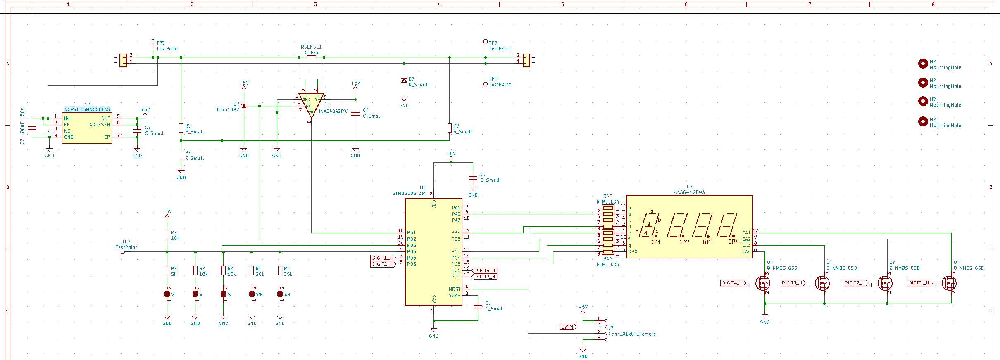

# Simple DC wattmeter:

Status: in progress, untested, unfinished

Screenshot: 

Components:

* STM8S003 microcontroller
* INA240 current shunt sense
* NCP781 5v linear regulator

Features:

* Configurable with solder-jumpers, to show:
   * Volts
   * Watts
   * Amps
   * Watt-hours
   * Amp-hours

* Minimal STM8 + segment LED display
* Linear-regulator powered (max current?) - need to check, tricks with cpu sleep, display dimming on high voltage? Or zener diode + resistor pre-regulator
* XT60 in - out
* Serial ouptut multiplexed onto segment outputs, activated only between digit cycle somehow? (or ability to choose serial ouptut instead of digits?)